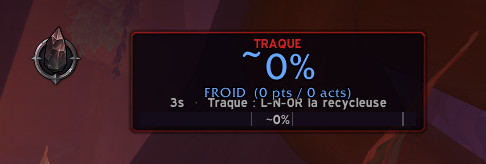
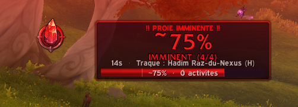

# 🔴 MidnightHuntTracker

**Addon WoW (Midnight)** pour suivre la progression de la **traque aux proies** avec un affichage clair et des alertes sonores.

> L'API WoW n'expose que 4 phases discrètes (Froid/Tiède/Chaud/Imminent), pas un pourcentage continu. Cet addon estime un **% approximatif** en comptant les points pondérés de chaque activité, et s'améliore à chaque traque grâce à l'auto-calibration.

## Aperçu

| Phase Froid (début de traque) | Proie Imminente |
|:---:|:---:|
|  |  |

## Fonctionnalités

### 🎯 Suivi de progression
- Affichage du **% estimé** en gros, visible en un coup d'œil
- **4 phases** avec couleurs distinctes : 🔵 Froid → 🟡 Tiède → 🟠 Chaud → 🔴 Imminent
- Barre de progression continue avec marqueurs de phase

### ⚖️ Points pondérés (v5.1)
- Les activités sont pondérées selon leur impact réel sur la traque
- Une expédition (+5 stacks) compte **5 points**, un rare (+1 stack) compte **1 point**
- Résultat : le % estimé reflète mieux la progression réelle

### 📊 Auto-calibration
- L'addon apprend combien de points chaque phase nécessite
- Plus tu fais de traques, plus l'estimation du % est précise
- Les données sont sauvegardées entre les sessions

### 🔔 Alertes
- **Alertes sonores** à chaque changement de phase
- **Alerte Raid Warning** quand la proie est imminente
- Messages dans le chat avec couleurs

### 🪟 Interface
- Cadre déplaçable et redimensionnable
- Affiche : %, phase, points/activités, timer, nom de la proie
- Se verrouille en place avec `/mht lock`

## Installation

1. Télécharger ou cloner ce repo :
   ```
   git clone https://github.com/m4dm4rtig4n/MidnightHuntTracker.git
   ```
2. Placer le dossier `MidnightHuntTracker` dans :
   ```
   World of Warcraft/_retail_/Interface/AddOns/
   ```
3. Relancer WoW ou `/reload`

## Commandes

| Commande | Description |
|---|---|
| `/mht` | Afficher l'aide |
| `/mht show` / `hide` | Afficher / masquer le cadre |
| `/mht probe` | Scan complet (widget, aura, quête, monnaie) |
| `/mht diag` | Diagnostic rapide de l'état actuel |
| `/mht log` | Historique des 25 derniers événements |
| `/mht cal` | Voir les données de calibration |
| `/mht lock` | Verrouiller / déverrouiller le cadre |
| `/mht scale 0.5-3` | Changer la taille du cadre |
| `/mht sound` | Activer / désactiver les sons |
| `/mht test` | Lancer une simulation des 4 phases |
| `/mht reset` | Réinitialiser (efface la calibration) |
| `/mht clearlog` | Effacer les logs (garde la calibration) |

Alias disponible : `/traque`

## Comment ça marche

### Détection
L'addon utilise plusieurs sources de données WoW :
- **`C_UIWidgetManager.GetPreyHuntProgressWidgetVisualizationInfo()`** — retourne la phase actuelle (Cold=0, Warm=1, Hot=2, Final=3)
- **`C_UnitAuras.GetPlayerAuraBySpellID(459731)`** — aura "Appel de maître chasseur", dont les stacks changent à chaque activité
- **`C_QuestLog.GetActivePreyQuest()`** — quête de traque active

### Calcul du pourcentage
```
% = PhaseBase + (points / pointsEstimésParPhase) × PlagePhase

Phases :
  FROID    →   0% à  40%
  TIÈDE    →  40% à  55%  (peut être sautée)
  CHAUD    →  55% à  95%
  IMMINENT → 100%
```

Le "poids" de chaque activité est calculé à partir du delta de stacks de l'aura :
- Delta positif (ex: stacks 1→5) = **+4 points**
- Reset de stacks (ex: 6→1) = **+1 point** minimum

### Calibration automatique
À chaque transition de phase, l'addon enregistre combien de points pondérés cette phase a nécessité. Ces données sont moyennées avec les traques précédentes pour améliorer l'estimation.

## Limitations connues

- L'API WoW ne fournit **pas** de pourcentage exact — seulement 4 phases discrètes
- Le % affiché est une **estimation** qui s'améliore avec l'usage
- Les stacks d'aura peuvent se réinitialiser (cycle), ce qui limite la précision du poids lors des resets
- Certaines phases peuvent être **sautées** (ex: Froid → Chaud directement)
- L'addon doit tourner depuis le début de la traque pour compter les activités

## Prérequis

- World of Warcraft: **Midnight** (12.0+)
- Niveau 90 avec accès au système de traque aux proies

## Licence

MIT

---

*Créé avec l'aide de Claude (Anthropic)*
